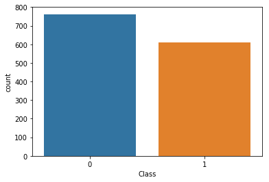
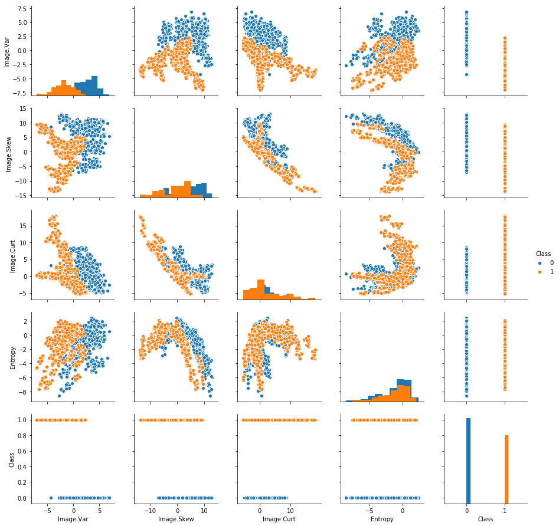

```python
import pandas as pd
data = pd.read_csv('bank_note_data.csv')
data.head()
```


<div>
<style scoped>
    .dataframe tbody tr th:only-of-type {
        vertical-align: middle;
    }

    .dataframe tbody tr th {
        vertical-align: top;
    }

    .dataframe thead th {
        text-align: right;
    }
</style>
<table border="1" class="dataframe">
  <thead>
    <tr style="text-align: right;">
      <th></th>
      <th>Image.Var</th>
      <th>Image.Skew</th>
      <th>Image.Curt</th>
      <th>Entropy</th>
      <th>Class</th>
    </tr>
  </thead>
  <tbody>
    <tr>
      <th>0</th>
      <td>3.62160</td>
      <td>8.6661</td>
      <td>-2.8073</td>
      <td>-0.44699</td>
      <td>0</td>
    </tr>
    <tr>
      <th>1</th>
      <td>4.54590</td>
      <td>8.1674</td>
      <td>-2.4586</td>
      <td>-1.46210</td>
      <td>0</td>
    </tr>
    <tr>
      <th>2</th>
      <td>3.86600</td>
      <td>-2.6383</td>
      <td>1.9242</td>
      <td>0.10645</td>
      <td>0</td>
    </tr>
    <tr>
      <th>3</th>
      <td>3.45660</td>
      <td>9.5228</td>
      <td>-4.0112</td>
      <td>-3.59440</td>
      <td>0</td>
    </tr>
    <tr>
      <th>4</th>
      <td>0.32924</td>
      <td>-4.4552</td>
      <td>4.5718</td>
      <td>-0.98880</td>
      <td>0</td>
    </tr>
  </tbody>
</table>
</div>


# EDA


```python
import seaborn as sns
%matplotlib inline

# Create a Countplot of the Classes (Authentic 1 vs Fake 0)
sns.countplot(x='Class',data=data)
```


    <matplotlib.axes._subplots.AxesSubplot at 0x1a1af8c828>





```python
sns.pairplot(data,hue='Class',diag_kind = 'hist')
```


    <seaborn.axisgrid.PairGrid at 0x118768898>





# Data Preparation

We standardize our data first.


```python
from sklearn.preprocessing import StandardScaler
scaler = StandardScaler()
scaler.fit(data.drop('Class',axis=1))
```


    StandardScaler(copy=True, with_mean=True, with_std=True)


```python
scaled_features = scaler.fit_transform(data.drop('Class',axis=1))
```


```python
df_feat = pd.DataFrame(scaled_features,columns=data.columns[:-1])
df_feat.head()
```


<div>
<style scoped>
    .dataframe tbody tr th:only-of-type {
        vertical-align: middle;
    }

    .dataframe tbody tr th {
        vertical-align: top;
    }

    .dataframe thead th {
        text-align: right;
    }
</style>
<table border="1" class="dataframe">
  <thead>
    <tr style="text-align: right;">
      <th></th>
      <th>Image.Var</th>
      <th>Image.Skew</th>
      <th>Image.Curt</th>
      <th>Entropy</th>
    </tr>
  </thead>
  <tbody>
    <tr>
      <th>0</th>
      <td>1.121806</td>
      <td>1.149455</td>
      <td>-0.975970</td>
      <td>0.354561</td>
    </tr>
    <tr>
      <th>1</th>
      <td>1.447066</td>
      <td>1.064453</td>
      <td>-0.895036</td>
      <td>-0.128767</td>
    </tr>
    <tr>
      <th>2</th>
      <td>1.207810</td>
      <td>-0.777352</td>
      <td>0.122218</td>
      <td>0.618073</td>
    </tr>
    <tr>
      <th>3</th>
      <td>1.063742</td>
      <td>1.295478</td>
      <td>-1.255397</td>
      <td>-1.144029</td>
    </tr>
    <tr>
      <th>4</th>
      <td>-0.036772</td>
      <td>-1.087038</td>
      <td>0.736730</td>
      <td>0.096587</td>
    </tr>
  </tbody>
</table>
</div>


# Train Test Split


```python
X = df_feat
y = data['Class']

from sklearn.model_selection import train_test_split
X_train, X_test, y_train, y_test = train_test_split(X, y, test_size=0.3)
```

# TensorFlow


```python
import tensorflow as tf

df_feat.columns
```


    Index(['Image.Var', 'Image.Skew', 'Image.Curt', 'Entropy'], dtype='object')


```python
image_var = tf.feature_column.numeric_column("Image.Var")
image_skew = tf.feature_column.numeric_column('Image.Skew')
image_curt = tf.feature_column.numeric_column('Image.Curt')
entropy =tf.feature_column.numeric_column('Entropy')
feat_cols = [image_var,image_skew,image_curt,entropy]
```

## We will run this in .py files.


```python
classifier = tf.estimator.DNNClassifier(hidden_units=[10, 20, 10], n_classes=2,feature_columns=feat_cols)
```


```python
input_func = tf.estimator.inputs.pandas_input_fn(x=X_train,y=y_train,batch_size=20,shuffle=True)
```


```python
classifier.train(input_fn=input_func,steps=500)
```

## Model Evaluation


```python
pred_fn = tf.estimator.inputs.pandas_input_fn(x=X_test,batch_size=len(X_test),shuffle=False)
```


```python
note_predictions = list(classifier.predict(input_fn=pred_fn))
```


```python
note_predictions[0]
```


```python
final_preds  = []
for pred in note_predictions:
    final_preds.append(pred['class_ids'][0])
```


```python
from sklearn.metrics import classification_report,confusion_matrix
```


```python
print(confusion_matrix(y_test,final_preds))
```

[[209  20]
 [  0 183]]


```python
print(classification_report(y_test,final_preds))
```


```python
              precision    recall  f1-score   support

           0       1.00      0.91      0.95       229
           1       0.90      1.00      0.95       183

   micro avg       0.95      0.95      0.95       412
   macro avg       0.95      0.96      0.95       412
weighted avg       0.96      0.95      0.95       412
```

The results are from runing on terminal with .py files.


```python

```
