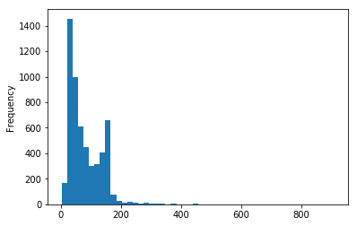
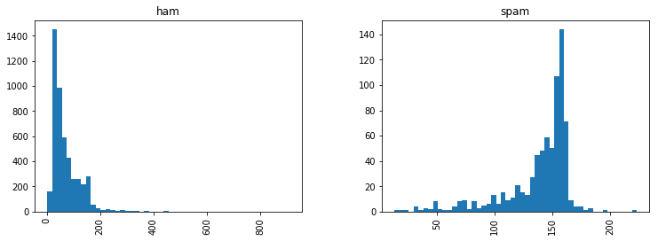

# NLP (Natural Language Processing)

We use [SMS Spam Collection Data Set](https://archive.ics.uci.edu/ml/datasets/SMS+Spam+Collection) 


```python
import nltk # this is NLP took kit
# nltk.download() #Download the necessary datasets
messages = [line.rstrip() for line in open('smsspamcollection/SMSSpamCollection')]
print(len(messages))
```

    5574


```python
for message_no, message in enumerate(messages[:10]):
    print(message_no, message)
    print('\n')
```

    0 ham	Go until jurong point, crazy.. Available only in bugis n great world la e buffet... Cine there got amore wat...
    
    
    1 ham	Ok lar... Joking wif u oni...
    
    
    2 spam	Free entry in 2 a wkly comp to win FA Cup final tkts 21st May 2005. Text FA to 87121 to receive entry question(std txt rate)T&C's apply 08452810075over18's
    
    
    3 ham	U dun say so early hor... U c already then say...
    
    
    4 ham	Nah I don't think he goes to usf, he lives around here though
    
    
    5 spam	FreeMsg Hey there darling it's been 3 week's now and no word back! I'd like some fun you up for it still? Tb ok! XxX std chgs to send, £1.50 to rcv
    
    
    6 ham	Even my brother is not like to speak with me. They treat me like aids patent.
    
    
    7 ham	As per your request 'Melle Melle (Oru Minnaminunginte Nurungu Vettam)' has been set as your callertune for all Callers. Press *9 to copy your friends Callertune
    
    
    8 spam	WINNER!! As a valued network customer you have been selected to receivea £900 prize reward! To claim call 09061701461. Claim code KL341. Valid 12 hours only.
    
    
    9 spam	Had your mobile 11 months or more? U R entitled to Update to the latest colour mobiles with camera for Free! Call The Mobile Update Co FREE on 08002986030
    
    


Due to the spacing we can tell that this is a [TSV](http://en.wikipedia.org/wiki/Tab-separated_values) ("tab separated values") file, where the first column is a label saying whether the given message is a normal message (commonly known as "ham") or "spam". The second column is the message itself. (Note our numbers aren't part of the file, they are just from the **enumerate** call).

Using these labeled ham and spam examples, we'll **train a machine learning model to learn to discriminate between ham/spam automatically**. Then, with a trained model, we'll be able to **classify arbitrary unlabeled messages** as ham or spam.

We will parse TSV using pandas.


```python
import pandas as pd
messages = pd.read_csv('smsspamcollection/SMSSpamCollection', sep='\t',
                           names=["label", "message"])
messages.head()
```


<div>
<style scoped>
    .dataframe tbody tr th:only-of-type {
        vertical-align: middle;
    }

    .dataframe tbody tr th {
        vertical-align: top;
    }

    .dataframe thead th {
        text-align: right;
    }
</style>
<table border="1" class="dataframe">
  <thead>
    <tr style="text-align: right;">
      <th></th>
      <th>label</th>
      <th>message</th>
    </tr>
  </thead>
  <tbody>
    <tr>
      <th>0</th>
      <td>ham</td>
      <td>Go until jurong point, crazy.. Available only ...</td>
    </tr>
    <tr>
      <th>1</th>
      <td>ham</td>
      <td>Ok lar... Joking wif u oni...</td>
    </tr>
    <tr>
      <th>2</th>
      <td>spam</td>
      <td>Free entry in 2 a wkly comp to win FA Cup fina...</td>
    </tr>
    <tr>
      <th>3</th>
      <td>ham</td>
      <td>U dun say so early hor... U c already then say...</td>
    </tr>
    <tr>
      <th>4</th>
      <td>ham</td>
      <td>Nah I don't think he goes to usf, he lives aro...</td>
    </tr>
  </tbody>
</table>
</div>


# EDA


```python
messages.describe()
```


<div>
<style scoped>
    .dataframe tbody tr th:only-of-type {
        vertical-align: middle;
    }

    .dataframe tbody tr th {
        vertical-align: top;
    }

    .dataframe thead th {
        text-align: right;
    }
</style>
<table border="1" class="dataframe">
  <thead>
    <tr style="text-align: right;">
      <th></th>
      <th>label</th>
      <th>message</th>
    </tr>
  </thead>
  <tbody>
    <tr>
      <th>count</th>
      <td>5572</td>
      <td>5572</td>
    </tr>
    <tr>
      <th>unique</th>
      <td>2</td>
      <td>5169</td>
    </tr>
    <tr>
      <th>top</th>
      <td>ham</td>
      <td>Sorry, I'll call later</td>
    </tr>
    <tr>
      <th>freq</th>
      <td>4825</td>
      <td>30</td>
    </tr>
  </tbody>
</table>
</div>


```python
messages.groupby('label').describe()
```


<div>
<style scoped>
    .dataframe tbody tr th:only-of-type {
        vertical-align: middle;
    }

    .dataframe tbody tr th {
        vertical-align: top;
    }

    .dataframe thead tr th {
        text-align: left;
    }

    .dataframe thead tr:last-of-type th {
        text-align: right;
    }
</style>
<table border="1" class="dataframe">
  <thead>
    <tr>
      <th></th>
      <th colspan="4" halign="left">message</th>
    </tr>
    <tr>
      <th></th>
      <th>count</th>
      <th>unique</th>
      <th>top</th>
      <th>freq</th>
    </tr>
    <tr>
      <th>label</th>
      <th></th>
      <th></th>
      <th></th>
      <th></th>
    </tr>
  </thead>
  <tbody>
    <tr>
      <th>ham</th>
      <td>4825</td>
      <td>4516</td>
      <td>Sorry, I'll call later</td>
      <td>30</td>
    </tr>
    <tr>
      <th>spam</th>
      <td>747</td>
      <td>653</td>
      <td>Please call our customer service representativ...</td>
      <td>4</td>
    </tr>
  </tbody>
</table>
</div>


As we continue our analysis we want to start thinking about the features we are going to be using. This goes along with the general idea of [feature engineering](https://en.wikipedia.org/wiki/Feature_engineering). The better your domain knowledge on the data, the better your ability to engineer more features from it. 

Let's make a new column to detect how long the text messages are:


```python
messages['length'] = messages['message'].apply(len)
messages.head()
```


<div>
<style scoped>
    .dataframe tbody tr th:only-of-type {
        vertical-align: middle;
    }

    .dataframe tbody tr th {
        vertical-align: top;
    }

    .dataframe thead th {
        text-align: right;
    }
</style>
<table border="1" class="dataframe">
  <thead>
    <tr style="text-align: right;">
      <th></th>
      <th>label</th>
      <th>message</th>
      <th>length</th>
    </tr>
  </thead>
  <tbody>
    <tr>
      <th>0</th>
      <td>ham</td>
      <td>Go until jurong point, crazy.. Available only ...</td>
      <td>111</td>
    </tr>
    <tr>
      <th>1</th>
      <td>ham</td>
      <td>Ok lar... Joking wif u oni...</td>
      <td>29</td>
    </tr>
    <tr>
      <th>2</th>
      <td>spam</td>
      <td>Free entry in 2 a wkly comp to win FA Cup fina...</td>
      <td>155</td>
    </tr>
    <tr>
      <th>3</th>
      <td>ham</td>
      <td>U dun say so early hor... U c already then say...</td>
      <td>49</td>
    </tr>
    <tr>
      <th>4</th>
      <td>ham</td>
      <td>Nah I don't think he goes to usf, he lives aro...</td>
      <td>61</td>
    </tr>
  </tbody>
</table>
</div>


## Data Visualization


```python
import matplotlib.pyplot as plt
import seaborn as sns

%matplotlib inline
```


```python
messages['length'].plot(bins=50, kind='hist') 
```


    <matplotlib.axes._subplots.AxesSubplot at 0x1a1b9f62e8>





```python
messages.length.describe()
```


    count    5572.000000
    mean       80.489950
    std        59.942907
    min         2.000000
    25%        36.000000
    50%        62.000000
    75%       122.000000
    max       910.000000
    Name: length, dtype: float64


We will take a look at the longest message.


```python
messages[messages['length'] == 910]['message'].iloc[0]
```


    "For me the love should start with attraction.i should feel that I need her every time around me.she should be the first thing which comes in my thoughts.I would start the day and end it with her.she should be there every time I dream.love will be then when my every breath has her name.my life should happen around her.my life will be named to her.I would cry for her.will give all my happiness and take all her sorrows.I will be ready to fight with anyone for her.I will be in love when I will be doing the craziest things for her.love will be when I don't have to proove anyone that my girl is the most beautiful lady on the whole planet.I will always be singing praises for her.love will be when I start up making chicken curry and end up makiing sambar.life will be the most beautiful then.will get every morning and thank god for the day because she is with me.I would like to say a lot..will tell later.."


```python
messages.hist(column='length', by='label', bins=50,figsize=(12,4))
```


    array([<matplotlib.axes._subplots.AxesSubplot object at 0x1a1bd59898>,
           <matplotlib.axes._subplots.AxesSubplot object at 0x1a1bda87f0>],
          dtype=object)





***It seems spam is longer.***

## Text Pre-proessing

We'll convert the raw messages (sequence of characters) into vectors (sequences of numbers).

As a first step, let's write a function that will split a message into its individual words and return a list. We'll also remove very common words, ('the', 'a', etc..). To do this we will take advantage of the NLTK library.

First removing punctuation. We can just take advantage of Python's built-in **string** library to get a quick list of all the possible punctuation:


```python
import string

mess = 'Sample message! Notice: it has punctuation.'

# Check characters to see if they are in punctuation
nopunc = [char for char in mess if char not in string.punctuation]

# Join the characters again to form the string.
nopunc = ''.join(nopunc)
```


```python
from nltk.corpus import stopwords
stopwords.words('english')[0:10] # Show some stop words
```


    ['i', 'me', 'my', 'myself', 'we', 'our', 'ours', 'ourselves', 'you', "you're"]


```python
nopunc.split()
```


    ['Sample', 'message', 'Notice', 'it', 'has', 'punctuation']


```python
# Now just remove any stopwords
clean_mess = [word for word in nopunc.split() if word.lower() not in stopwords.words('english')]
```


```python
clean_mess
```


    ['Sample', 'message', 'Notice', 'punctuation']


```python
def text_process(mess):
    """
    Takes in a string of text, then performs the following:
    1. Remove all punctuation
    2. Remove all stopwords
    3. Returns a list of the cleaned text
    """
    # Check characters to see if they are in punctuation
    nopunc = [char for char in mess if char not in string.punctuation]

    # Join the characters again to form the string.
    nopunc = ''.join(nopunc)
    
    # Now just remove any stopwords
    return [word for word in nopunc.split() if word.lower() not in stopwords.words('english')]
```


```python
messages.head()
```


<div>
<style scoped>
    .dataframe tbody tr th:only-of-type {
        vertical-align: middle;
    }

    .dataframe tbody tr th {
        vertical-align: top;
    }

    .dataframe thead th {
        text-align: right;
    }
</style>
<table border="1" class="dataframe">
  <thead>
    <tr style="text-align: right;">
      <th></th>
      <th>label</th>
      <th>message</th>
      <th>length</th>
    </tr>
  </thead>
  <tbody>
    <tr>
      <th>0</th>
      <td>ham</td>
      <td>Go until jurong point, crazy.. Available only ...</td>
      <td>111</td>
    </tr>
    <tr>
      <th>1</th>
      <td>ham</td>
      <td>Ok lar... Joking wif u oni...</td>
      <td>29</td>
    </tr>
    <tr>
      <th>2</th>
      <td>spam</td>
      <td>Free entry in 2 a wkly comp to win FA Cup fina...</td>
      <td>155</td>
    </tr>
    <tr>
      <th>3</th>
      <td>ham</td>
      <td>U dun say so early hor... U c already then say...</td>
      <td>49</td>
    </tr>
    <tr>
      <th>4</th>
      <td>ham</td>
      <td>Nah I don't think he goes to usf, he lives aro...</td>
      <td>61</td>
    </tr>
  </tbody>
</table>
</div>


```python
# Check to make sure its working
messages['message'].head(5).apply(text_process)
```


    0    [Go, jurong, point, crazy, Available, bugis, n...
    1                       [Ok, lar, Joking, wif, u, oni]
    2    [Free, entry, 2, wkly, comp, win, FA, Cup, fin...
    3        [U, dun, say, early, hor, U, c, already, say]
    4    [Nah, dont, think, goes, usf, lives, around, t...
    Name: message, dtype: object


```python
# Show original dataframe
messages.head()
```


<div>
<style scoped>
    .dataframe tbody tr th:only-of-type {
        vertical-align: middle;
    }

    .dataframe tbody tr th {
        vertical-align: top;
    }

    .dataframe thead th {
        text-align: right;
    }
</style>
<table border="1" class="dataframe">
  <thead>
    <tr style="text-align: right;">
      <th></th>
      <th>label</th>
      <th>message</th>
      <th>length</th>
    </tr>
  </thead>
  <tbody>
    <tr>
      <th>0</th>
      <td>ham</td>
      <td>Go until jurong point, crazy.. Available only ...</td>
      <td>111</td>
    </tr>
    <tr>
      <th>1</th>
      <td>ham</td>
      <td>Ok lar... Joking wif u oni...</td>
      <td>29</td>
    </tr>
    <tr>
      <th>2</th>
      <td>spam</td>
      <td>Free entry in 2 a wkly comp to win FA Cup fina...</td>
      <td>155</td>
    </tr>
    <tr>
      <th>3</th>
      <td>ham</td>
      <td>U dun say so early hor... U c already then say...</td>
      <td>49</td>
    </tr>
    <tr>
      <th>4</th>
      <td>ham</td>
      <td>Nah I don't think he goes to usf, he lives aro...</td>
      <td>61</td>
    </tr>
  </tbody>
</table>
</div>


# Show original dataframe
There are a lot of ways to continue normalizing this text. Such as [Stemming](https://en.wikipedia.org/wiki/Stemming) or distinguishing by [part of speech](http://www.nltk.org/book/ch05.html).

[NLTK book online](http://www.nltk.org/book/)

## Vectorization
Currently, we have the messages as lists of tokens (also known as [lemmas](http://nlp.stanford.edu/IR-book/html/htmledition/stemming-and-lemmatization-1.html)) and now we need to convert each of those messages into a vector the SciKit Learn's algorithm models can work with.

Now we'll convert each message, represented as a list of tokens (lemmas) above, into a vector that machine learning models can understand.

We'll do that in three steps using the bag-of-words model:

1. Count how many times does a word occur in each message (Known as term frequency)

2. Weigh the counts, so that frequent tokens get lower weight (inverse document frequency)

3. Normalize the vectors to unit length, to abstract from the original text length (L2 norm)

Let's begin the first step:

Each vector will have as many dimensions as there are unique words in the SMS corpus.  We will first use SciKit Learn's **CountVectorizer**. This model will convert a collection of text documents to a matrix of token counts.

We can imagine this as a 2-Dimensional matrix. Where the 1-dimension is the entire vocabulary (1 row per word) and the other dimension are the actual documents, in this case a column per text message. 

For example:

<table border = “1“>
<tr>
<th></th> <th>Message 1</th> <th>Message 2</th> <th>...</th> <th>Message N</th> 
</tr>
<tr>
<td><b>Word 1 Count</b></td><td>0</td><td>1</td><td>...</td><td>0</td>
</tr>
<tr>
<td><b>Word 2 Count</b></td><td>0</td><td>0</td><td>...</td><td>0</td>
</tr>
<tr>
<td><b>...</b></td> <td>1</td><td>2</td><td>...</td><td>0</td>
</tr>
<tr>
<td><b>Word N Count</b></td> <td>0</td><td>1</td><td>...</td><td>1</td>
</tr>
</table>


Since there are so many messages, we can expect a lot of zero counts for the presence of that word in that document. Because of this, SciKit Learn will output a [Sparse Matrix](https://en.wikipedia.org/wiki/Sparse_matrix).


```python
from sklearn.feature_extraction.text import CountVectorizer
# Might take awhile...
bow_transformer = CountVectorizer(analyzer=text_process).fit(messages['message'])

# Print total number of vocab words
print(len(bow_transformer.vocabulary_))
```

    11425


```python
messageSample = messages['message'][4]
print(messageSample)
```

    Nah I don't think he goes to usf, he lives around here though


```python
bow4 = bow_transformer.transform([messageSample])
print(bow4)
print(bow4.shape)
```

      (0, 2948)	1
      (0, 4777)	1
      (0, 6123)	1
      (0, 6877)	1
      (0, 7842)	1
      (0, 10433)	1
      (0, 10450)	1
      (0, 10799)	1
    (1, 11425)


All unique words.


```python
print(bow_transformer.get_feature_names()[4777])
print(bow_transformer.get_feature_names()[10799])
```

    around
    usf


Now we can use **.transform** on our Bag-of-Words (bow) transformed object and transform the entire DataFrame of messages. Let's go ahead and check out how the bag-of-words counts for the entire SMS corpus is a large, sparse matrix:


```python
messages_bow = bow_transformer.transform(messages['message'])
print('Shape of Sparse Matrix: ', messages_bow.shape)
print('Amount of Non-Zero occurences: ', messages_bow.nnz)
```

    Shape of Sparse Matrix:  (5572, 11425)
    Amount of Non-Zero occurences:  50548


```python
sparsity = (100.0 * messages_bow.nnz / (messages_bow.shape[0] * messages_bow.shape[1]))
print('sparsity: {}'.format(round(sparsity)))
```

    sparsity: 0


The term weighting and normalization can be done with [TF-IDF](http://en.wikipedia.org/wiki/Tf%E2%80%93idf), using scikit-learn's `TfidfTransformer`.

____
### So what is TF-IDF?
TF-IDF stands for *term frequency-inverse document frequency*, and the tf-idf weight is a weight often used in information retrieval and text mining. This weight is a statistical measure used to evaluate how important a word is to a document in a collection or corpus. The importance increases proportionally to the number of times a word appears in the document but is offset by the frequency of the word in the corpus. Variations of the tf-idf weighting scheme are often used by search engines as a central tool in scoring and ranking a document's relevance given a user query.

One of the simplest ranking functions is computed by summing the tf-idf for each query term; many more sophisticated ranking functions are variants of this simple model.

Typically, the tf-idf weight is composed by two terms: the first computes the normalized Term Frequency (TF), aka. the number of times a word appears in a document, divided by the total number of words in that document; the second term is the Inverse Document Frequency (IDF), computed as the logarithm of the number of the documents in the corpus divided by the number of documents where the specific term appears.

**TF: Term Frequency**, which measures how frequently a term occurs in a document. Since every document is different in length, it is possible that a term would appear much more times in long documents than shorter ones. Thus, the term frequency is often divided by the document length (aka. the total number of terms in the document) as a way of normalization: 

*TF(t) = (Number of times term t appears in a document) / (Total number of terms in the document).*

**IDF: Inverse Document Frequency**, which measures how important a term is. While computing TF, all terms are considered equally important. However it is known that certain terms, such as "is", "of", and "that", may appear a lot of times but have little importance. Thus we need to weigh down the frequent terms while scale up the rare ones, by computing the following: 

*IDF(t) = log_e(Total number of documents / Number of documents with term t in it).*

See below for a simple example.

**Example:**

Consider a document containing 100 words wherein the word cat appears 3 times. 

The term frequency (i.e., tf) for cat is then (3 / 100) = 0.03. Now, assume we have 10 million documents and the word cat appears in one thousand of these. Then, the inverse document frequency (i.e., idf) is calculated as log(10,000,000 / 1,000) = 4. Thus, the Tf-idf weight is the product of these quantities: 0.03 * 4 = 0.12.
____


```python
from sklearn.feature_extraction.text import TfidfTransformer

tfidf_transformer = TfidfTransformer().fit(messages_bow)
tfidf4 = tfidf_transformer.transform(bow4)
print(tfidf4)
```

      (0, 10799)	0.4019015462543087
      (0, 10450)	0.35407004444444734
      (0, 10433)	0.27043580251222216
      (0, 7842)	0.4457437273623316
      (0, 6877)	0.35407004444444734
      (0, 6123)	0.24090226292109554
      (0, 4777)	0.3104226271508041
      (0, 2948)	0.4019015462543087


We check what is the IDF (inverse document frequency) of the word `"u"` and of word `"university"`?


```python
print(tfidf_transformer.idf_[bow_transformer.vocabulary_['u']])
print(tfidf_transformer.idf_[bow_transformer.vocabulary_['university']])
```

    3.2800524267409408
    8.527076498901426


To transform the entire bag-of-words corpus into TF-IDF corpus at once:


```python
messages_tfidf = tfidf_transformer.transform(messages_bow)
print(messages_tfidf.shape)
```

    (5572, 11425)


## Training Data

We can actually use almost any sort of classification algorithms. For a [variety of reasons](http://www.inf.ed.ac.uk/teaching/courses/inf2b/learnnotes/inf2b-learn-note07-2up.pdf), the Naive Bayes classifier algorithm is a good choice.


```python
from sklearn.naive_bayes import MultinomialNB
spam_detect_model = MultinomialNB().fit(messages_tfidf, messages['label'])
```


```python
print('predicted:', spam_detect_model.predict(tfidf4)[0])
print('expected:', messages.label[3])
```

    predicted: ham
    expected: ham


## Model Evaluation


```python
all_predictions = spam_detect_model.predict(messages_tfidf)
print(all_predictions)
```

    ['ham' 'ham' 'spam' ... 'ham' 'ham' 'ham']


```python
from sklearn.metrics import classification_report
print (classification_report(messages['label'], all_predictions))
```

                  precision    recall  f1-score   support
    
             ham       0.98      1.00      0.99      4825
            spam       1.00      0.85      0.92       747
    
       micro avg       0.98      0.98      0.98      5572
       macro avg       0.99      0.92      0.95      5572
    weighted avg       0.98      0.98      0.98      5572
    


In the above "evaluation",we evaluated accuracy on the same data we used for training. **You should never actually evaluate on the same dataset you train on!**

## Train Test Split


```python
from sklearn.model_selection import train_test_split

msg_train, msg_test, label_train, label_test = \
train_test_split(messages['message'], messages['label'], test_size=0.2)

print(len(msg_train), len(msg_test), len(msg_train) + len(msg_test))
```

    4457 1115 5572


## Creating a Data Pipeline

Let's run our model again and then predict off the test set. We will use SciKit Learn's [pipeline](http://scikit-learn.org/stable/modules/pipeline.html) capabilities to store a pipeline of workflow. This will allow us to set up all the transformations that we will do to the data for future use. Let's see an example of how it works:


```python
from sklearn.pipeline import Pipeline

pipeline = Pipeline([
    ('bow', CountVectorizer(analyzer=text_process)),  # strings to token integer counts
    ('tfidf', TfidfTransformer()),  # integer counts to weighted TF-IDF scores
    ('classifier', MultinomialNB()),  # train on TF-IDF vectors w/ Naive Bayes classifier
])
```


```python
pipeline.fit(msg_train,label_train)
```


    Pipeline(memory=None,
         steps=[('bow', CountVectorizer(analyzer=<function text_process at 0x1a1c11bbf8>,
            binary=False, decode_error='strict', dtype=<class 'numpy.int64'>,
            encoding='utf-8', input='content', lowercase=True, max_df=1.0,
            max_features=None, min_df=1, ngram_range=(1, 1), preprocessor=None...f=False, use_idf=True)), ('classifier', MultinomialNB(alpha=1.0, class_prior=None, fit_prior=True))])


```python
predictions = pipeline.predict(msg_test)
print(classification_report(predictions,label_test))
```

                  precision    recall  f1-score   support
    
             ham       1.00      0.95      0.97      1025
            spam       0.63      1.00      0.78        90
    
       micro avg       0.95      0.95      0.95      1115
       macro avg       0.82      0.97      0.87      1115
    weighted avg       0.97      0.95      0.96      1115
    


```python

```
