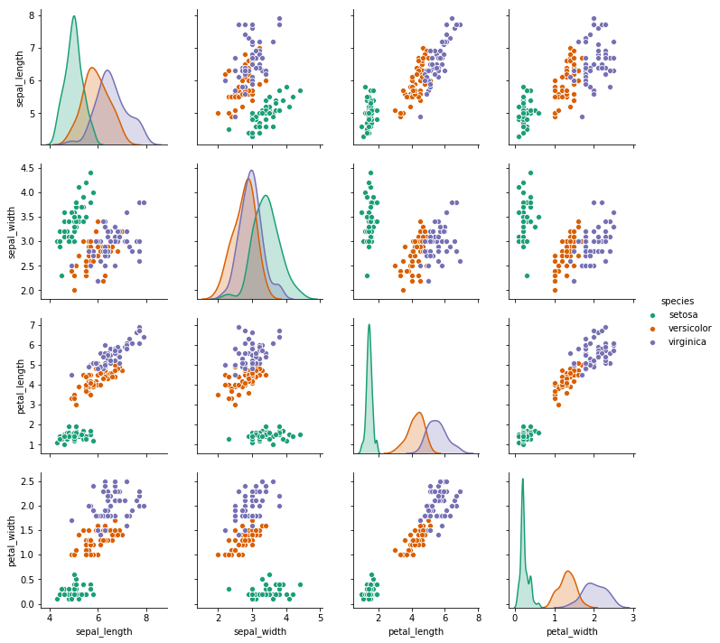
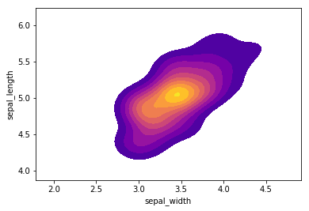

# The Iris Flower Classification
We will try to classify Iris Setosa from IPython.display.


```python
# The Iris Setosa
from IPython.display import Image
url = 'http://upload.wikimedia.org/wikipedia/commons/5/56/Kosaciec_szczecinkowaty_Iris_setosa.jpg'
Image(url,width=300, height=300)
```


```python
# The Iris Versicolor
from IPython.display import Image
url = 'http://upload.wikimedia.org/wikipedia/commons/4/41/Iris_versicolor_3.jpg'
Image(url,width=300, height=300)
```


```python
# The Iris Virginica
from IPython.display import Image
url = 'http://upload.wikimedia.org/wikipedia/commons/9/9f/Iris_virginica.jpg'
Image(url,width=300, height=300)
```


The iris dataset contains measurements for 150 iris flowers from three different species.

The three classes in the Iris dataset:

* Iris-setosa (n=50)
* Iris-versicolor (n=50)
* Iris-virginica (n=50)

The four features of the Iris dataset:

* sepal length in cm
* sepal width in cm
* petal length in cm
* petal width in cm

# Load The Data


```python
import seaborn as sns
iris = sns.load_dataset('iris')
```

# EDA


```python
import pandas as pd
import matplotlib.pyplot as plt
%matplotlib inline
```


```python
# Setosa is the most separable. 
sns.pairplot(iris,hue='species',palette='Dark2')
```

    /Users/luoqiaoen/anaconda3/lib/python3.7/site-packages/scipy/stats/stats.py:1713: FutureWarning: Using a non-tuple sequence for multidimensional indexing is deprecated; use `arr[tuple(seq)]` instead of `arr[seq]`. In the future this will be interpreted as an array index, `arr[np.array(seq)]`, which will result either in an error or a different result.
      return np.add.reduce(sorted[indexer] * weights, axis=axis) / sumval


    <seaborn.axisgrid.PairGrid at 0x1a163cf7f0>





**Create a kde plot of sepal_length versus sepal width for setosa species of flower.**


```python
setosa = iris[iris['species']=='setosa']
sns.kdeplot( setosa['sepal_width'], setosa['sepal_length'],
                 cmap="plasma", shade=True, shade_lowest=False)
```


    <matplotlib.axes._subplots.AxesSubplot at 0x1a16d07400>





# Train Test Split


```python
from sklearn.model_selection import train_test_split
X = iris.drop('species',axis=1)
y = iris['species']
X_train, X_test, y_train, y_test = train_test_split(X, y, test_size=0.30)
```

# Train Model


```python
from sklearn.svm import SVC
svc_model = SVC()
svc_model.fit(X_train,y_train)
```

    /Users/luoqiaoen/anaconda3/lib/python3.7/site-packages/sklearn/svm/base.py:196: FutureWarning: The default value of gamma will change from 'auto' to 'scale' in version 0.22 to account better for unscaled features. Set gamma explicitly to 'auto' or 'scale' to avoid this warning.
      "avoid this warning.", FutureWarning)


    SVC(C=1.0, cache_size=200, class_weight=None, coef0=0.0,
      decision_function_shape='ovr', degree=3, gamma='auto_deprecated',
      kernel='rbf', max_iter=-1, probability=False, random_state=None,
      shrinking=True, tol=0.001, verbose=False)


# Evaluation


```python
predictions = svc_model.predict(X_test)
from sklearn.metrics import classification_report,confusion_matrix
print(confusion_matrix(y_test,predictions))
```

    [[15  0  0]
     [ 0 10  2]
     [ 0  0 18]]


```python
print(classification_report(y_test,predictions))
```

                  precision    recall  f1-score   support
    
          setosa       1.00      1.00      1.00        15
      versicolor       1.00      0.83      0.91        12
       virginica       0.90      1.00      0.95        18
    
       micro avg       0.96      0.96      0.96        45
       macro avg       0.97      0.94      0.95        45
    weighted avg       0.96      0.96      0.95        45
    


# Gridsearch for Hyper Parameters


```python
from sklearn.model_selection import GridSearchCV
param_grid = {'C': [0.1,1, 10, 100], 'gamma': [1,0.1,0.01,0.001]} 
grid = GridSearchCV(SVC(),param_grid,refit=True,verbose=2)
grid.fit(X_train,y_train)
```

    /Users/luoqiaoen/anaconda3/lib/python3.7/site-packages/sklearn/model_selection/_split.py:2053: FutureWarning: You should specify a value for 'cv' instead of relying on the default value. The default value will change from 3 to 5 in version 0.22.
      warnings.warn(CV_WARNING, FutureWarning)
    [Parallel(n_jobs=1)]: Using backend SequentialBackend with 1 concurrent workers.
    [Parallel(n_jobs=1)]: Done   1 out of   1 | elapsed:    0.0s remaining:    0.0s


    Fitting 3 folds for each of 16 candidates, totalling 48 fits
    [CV] C=0.1, gamma=1 ..................................................
    [CV] ................................... C=0.1, gamma=1, total=   0.0s
    [CV] C=0.1, gamma=1 ..................................................
    [CV] ................................... C=0.1, gamma=1, total=   0.0s
    [CV] C=0.1, gamma=1 ..................................................
    [CV] ................................... C=0.1, gamma=1, total=   0.0s
    [CV] C=0.1, gamma=0.1 ................................................
    [CV] ................................. C=0.1, gamma=0.1, total=   0.0s
    [CV] C=0.1, gamma=0.1 ................................................
    [CV] ................................. C=0.1, gamma=0.1, total=   0.0s
    [CV] C=0.1, gamma=0.1 ................................................
    [CV] ................................. C=0.1, gamma=0.1, total=   0.0s
    [CV] C=0.1, gamma=0.01 ...............................................
    [CV] ................................ C=0.1, gamma=0.01, total=   0.0s
    [CV] C=0.1, gamma=0.01 ...............................................
    [CV] ................................ C=0.1, gamma=0.01, total=   0.0s
    [CV] C=0.1, gamma=0.01 ...............................................
    [CV] ................................ C=0.1, gamma=0.01, total=   0.0s
    [CV] C=0.1, gamma=0.001 ..............................................
    [CV] ............................... C=0.1, gamma=0.001, total=   0.0s
    [CV] C=0.1, gamma=0.001 ..............................................
    [CV] ............................... C=0.1, gamma=0.001, total=   0.0s
    [CV] C=0.1, gamma=0.001 ..............................................
    [CV] ............................... C=0.1, gamma=0.001, total=   0.0s
    [CV] C=1, gamma=1 ....................................................
    [CV] ..................................... C=1, gamma=1, total=   0.0s
    [CV] C=1, gamma=1 ....................................................
    [CV] ..................................... C=1, gamma=1, total=   0.0s
    [CV] C=1, gamma=1 ....................................................
    [CV] ..................................... C=1, gamma=1, total=   0.0s
    [CV] C=1, gamma=0.1 ..................................................
    [CV] ................................... C=1, gamma=0.1, total=   0.0s
    [CV] C=1, gamma=0.1 ..................................................
    [CV] ................................... C=1, gamma=0.1, total=   0.0s
    [CV] C=1, gamma=0.1 ..................................................
    [CV] ................................... C=1, gamma=0.1, total=   0.0s
    [CV] C=1, gamma=0.01 .................................................
    [CV] .................................. C=1, gamma=0.01, total=   0.0s
    [CV] C=1, gamma=0.01 .................................................
    [CV] .................................. C=1, gamma=0.01, total=   0.0s
    [CV] C=1, gamma=0.01 .................................................
    [CV] .................................. C=1, gamma=0.01, total=   0.0s
    [CV] C=1, gamma=0.001 ................................................
    [CV] ................................. C=1, gamma=0.001, total=   0.0s
    [CV] C=1, gamma=0.001 ................................................
    [CV] ................................. C=1, gamma=0.001, total=   0.0s
    [CV] C=1, gamma=0.001 ................................................
    [CV] ................................. C=1, gamma=0.001, total=   0.0s
    [CV] C=10, gamma=1 ...................................................
    [CV] .................................... C=10, gamma=1, total=   0.0s
    [CV] C=10, gamma=1 ...................................................
    [CV] .................................... C=10, gamma=1, total=   0.0s
    [CV] C=10, gamma=1 ...................................................
    [CV] .................................... C=10, gamma=1, total=   0.0s
    [CV] C=10, gamma=0.1 .................................................
    [CV] .................................. C=10, gamma=0.1, total=   0.0s
    [CV] C=10, gamma=0.1 .................................................
    [CV] .................................. C=10, gamma=0.1, total=   0.0s
    [CV] C=10, gamma=0.1 .................................................
    [CV] .................................. C=10, gamma=0.1, total=   0.0s
    [CV] C=10, gamma=0.01 ................................................
    [CV] ................................. C=10, gamma=0.01, total=   0.0s
    [CV] C=10, gamma=0.01 ................................................
    [CV] ................................. C=10, gamma=0.01, total=   0.0s
    [CV] C=10, gamma=0.01 ................................................
    [CV] ................................. C=10, gamma=0.01, total=   0.0s
    [CV] C=10, gamma=0.001 ...............................................
    [CV] ................................ C=10, gamma=0.001, total=   0.0s
    [CV] C=10, gamma=0.001 ...............................................
    [CV] ................................ C=10, gamma=0.001, total=   0.0s
    [CV] C=10, gamma=0.001 ...............................................
    [CV] ................................ C=10, gamma=0.001, total=   0.0s
    [CV] C=100, gamma=1 ..................................................
    [CV] ................................... C=100, gamma=1, total=   0.0s
    [CV] C=100, gamma=1 ..................................................
    [CV] ................................... C=100, gamma=1, total=   0.0s
    [CV] C=100, gamma=1 ..................................................
    [CV] ................................... C=100, gamma=1, total=   0.0s
    [CV] C=100, gamma=0.1 ................................................
    [CV] ................................. C=100, gamma=0.1, total=   0.0s
    [CV] C=100, gamma=0.1 ................................................
    [CV] ................................. C=100, gamma=0.1, total=   0.0s
    [CV] C=100, gamma=0.1 ................................................
    [CV] ................................. C=100, gamma=0.1, total=   0.0s
    [CV] C=100, gamma=0.01 ...............................................
    [CV] ................................ C=100, gamma=0.01, total=   0.0s
    [CV] C=100, gamma=0.01 ...............................................
    [CV] ................................ C=100, gamma=0.01, total=   0.0s
    [CV] C=100, gamma=0.01 ...............................................
    [CV] ................................ C=100, gamma=0.01, total=   0.0s
    [CV] C=100, gamma=0.001 ..............................................
    [CV] ............................... C=100, gamma=0.001, total=   0.0s
    [CV] C=100, gamma=0.001 ..............................................
    [CV] ............................... C=100, gamma=0.001, total=   0.0s
    [CV] C=100, gamma=0.001 ..............................................
    [CV] ............................... C=100, gamma=0.001, total=   0.0s


    [Parallel(n_jobs=1)]: Done  48 out of  48 | elapsed:    0.2s finished
    /Users/luoqiaoen/anaconda3/lib/python3.7/site-packages/sklearn/model_selection/_search.py:841: DeprecationWarning: The default of the `iid` parameter will change from True to False in version 0.22 and will be removed in 0.24. This will change numeric results when test-set sizes are unequal.
      DeprecationWarning)


    GridSearchCV(cv='warn', error_score='raise-deprecating',
           estimator=SVC(C=1.0, cache_size=200, class_weight=None, coef0=0.0,
      decision_function_shape='ovr', degree=3, gamma='auto_deprecated',
      kernel='rbf', max_iter=-1, probability=False, random_state=None,
      shrinking=True, tol=0.001, verbose=False),
           fit_params=None, iid='warn', n_jobs=None,
           param_grid={'C': [0.1, 1, 10, 100], 'gamma': [1, 0.1, 0.01, 0.001]},
           pre_dispatch='2*n_jobs', refit=True, return_train_score='warn',
           scoring=None, verbose=2)


```python
grid_predictions = grid.predict(X_test)
```


```python
print(confusion_matrix(y_test,grid_predictions))
```

    [[15  0  0]
     [ 0 10  2]
     [ 0  0 18]]


```python

```
